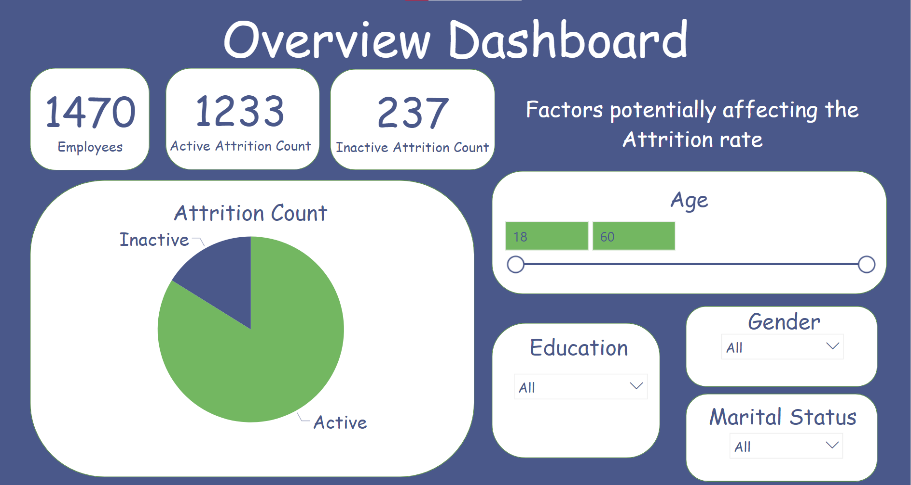

# Attrition-Dashboard-in-Power-BI

## About the Project

This project is a Attrition Dashboard made in Power BI. The aim of this dashboard is to highlight reasons for higher attrition rate.

## Screenshots

    <b>Overview Dashboard</b>

    <b>Demographic Dashboard</b>

    <b>Job Related Dashboard</b>

    <b>Payroll and Performance Dashboard</b>

    <b>Prior Employment and Tenure Dashboard</b>

    <b>Survey Dashboard</b>

## Opening the file

Open the Attrition Dashboard.pbix file in Power BI Desktop.
